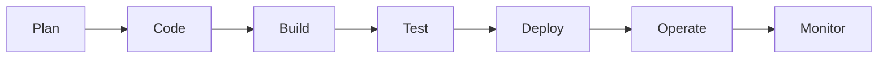

# EnjangSe
**`Infrastructure Engineer (SysAdmin/DevOps/Linux)`**
- Level : 1 - Job   : Infrastructure Engineer
- HP    : 3400 - MP    : 700 
- email : enjang.setiawan88@gmail.com
---
Skills: 
- Linux   - Bash Scripting - Python 
- Docker Container  - Ansible - AWS - Terraform

Certifications:
- AWS Cloud Practitioner
- Microsoft Azure AZ-900
- Linux Foundation LFCS
- Linux Comptia+
- LPI LPIC-1
```
module "tools" {
  tags = {
    Infrastructure = "VMware - AWS - GCP "
    IaaC           = "Terraform, Ansible"
    Workflows      = "GitActions, Jenkins"
    Containers     = "Docker , Kubernetes"
    S.O            = "Debian, CentOS, Ubuntu"
    Languages      = "Python , Bash"
    Networking     = "Cisco, Juniper"
     
  }

```

<!--
**enjangse88/enjangse88** is a ✨ _special_ ✨ repository because its `README.md` (this file) appears on your GitHub profile.

Here are some ideas to get you started:

- 🔭 I’m currently working 
on ...
- 🌱 I’m currently learning ...
- 👯 I’m looking to collaborate on ...
- 🤔 I’m looking for help with ...
- 💬 Ask me about ...
- 📫 How to reach me: ...
- 😄 Pronouns: ...
- ⚡ Fun fact: ...
-->
- I am currently learning DevSecOps, Github Action,Kubernetes.
